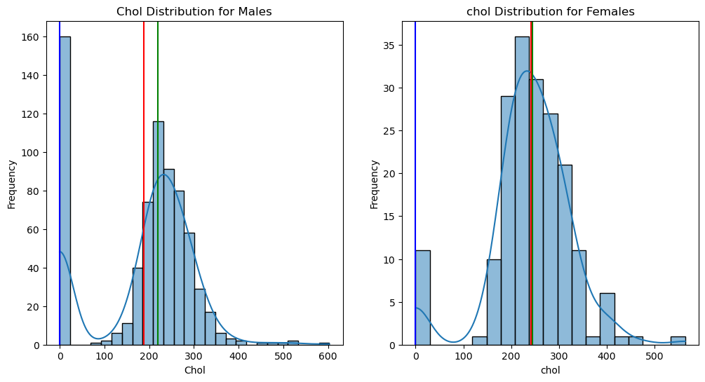
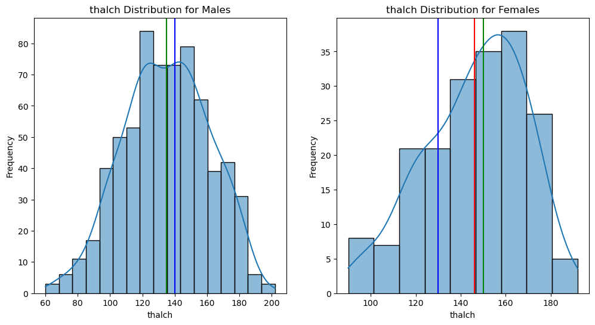

<p align="center">
  
</p>

<h1 align="center">Heart Disease Prediction with 9 ML Models</h1>

<p align="center">
  <em>Multi-class classification of cardiovascular disease risk using the UCI Heart Disease dataset</em>
</p>

<p align="center">
  
  
  
  
  
</p>

---

## About

The **World Health Organization** estimates 19.8–20.5 million deaths occur worldwide every year due to heart disease. Half of all deaths in developed countries are caused by cardiovascular diseases.

This project builds **9 machine learning models** on the UCI Heart Disease dataset to predict the presence and severity of heart disease (multi-class, 0–4). The goal is to identify the most relevant risk factors and determine the best-performing algorithm for early prognosis, enabling lifestyle changes in high-risk patients.

---

## Models Compared

| # | Model | CV Accuracy | Test Accuracy |
|---|-------|-------------|---------------|
| 1 | **Gradient Boosting** 🏆 | **65.44%** | **67.93%** |
| 2 | Random Forest | 67.35% | 65.76% |
| 3 | AdaBoost | 64.90% | 64.67% |
| 4 | Decision Tree | 61.90% | 63.59% |
| 5 | XGBoost | 66.94% | 61.96% |
| 6 | K-Nearest Neighbors | 58.78% | 59.78% |
| 7 | Support Vector Machine | 58.23% | 58.15% |
| 8 | Naive Bayes | 58.64% | 53.26% |
| 9 | Logistic Regression | 52.11% | 50.00% |

**Best Model:** Gradient Boosting saved to `best_model/heart_prediction_model_best`

---

## Dataset

| Detail | Value |
|--------|-------|
| **Source** | [UCI Heart Disease](https://www.kaggle.com/datasets/redwankarimsony/heart-disease-data) (Kaggle) |
| **Creators** | Hungarian Institute of Cardiology, University Hospital Zurich, University Hospital Basel, Cleveland Clinic Foundation |
| **Rows** | 920 (919 after outlier removal) |
| **Columns** | 16 (14 features + id + target) |
| **Target** | `num` — Multi-class (0 = no disease, 1–4 = severity) |
| **Task** | Multi-class classification (5 classes) |

### Features

| Column | Description | Type |
|--------|-------------|------|
| `age` | Age in years (28–77) | Numerical |
| `sex` | Male / Female | Categorical |
| `dataset` | Study origin (Cleveland, Hungary, Switzerland, VA Long Beach) | Categorical |
| `cp` | Chest pain type (typical angina, atypical angina, non-anginal, asymptomatic) | Categorical |
| `trestbps` | Resting blood pressure (mm Hg) | Numerical |
| `chol` | Serum cholesterol (mg/dl) | Numerical |
| `fbs` | Fasting blood sugar > 120 mg/dl | Categorical |
| `restecg` | Resting ECG results (normal, stt abnormality, lv hypertrophy) | Categorical |
| `thalch` | Maximum heart rate achieved | Numerical |
| `exang` | Exercise-induced angina | Categorical |
| `oldpeak` | ST depression induced by exercise relative to rest | Numerical |
| `slope` | Slope of peak exercise ST segment | Categorical |
| `ca` | Number of major vessels colored by fluoroscopy (0–3) | Numerical |
| `thal` | Thalassemia (normal, fixed defect, reversible defect) | Categorical |

---

## Project Structure

```
UCI_Heart_Disease_Data_ML/
├── data/
│   └── heart_disease_uci.csv              # Original UCI dataset
├── notebooks/
│   └── Heart_Disease_Prediction_with_9ML_Models.ipynb  # Full analysis
├── images/                                # EDA & results screenshots
├── best_model/
│   └── heart_prediction_model_best        # Pickled Gradient Boosting model
├── requirements.txt                       # Python dependencies
├── README.md
├── LICENSE
├── CONTRIBUTING.md
├── CODE_OF_CONDUCT.md
├── SECURITY.md
├── CHANGELOG.md
└── .gitignore
```

---

## Quick Start

### Prerequisites
- Python 3.10+
- pip

### Setup

```bash
git clone https://github.com/hmudassir865/UCI_Heart_Disease_Data_ML.git
cd UCI_Heart_Disease_Data_ML

python -m venv venv
source venv/bin/activate       # Linux/Mac
venv\Scripts\activate          # Windows

pip install -r requirements.txt
```

### Run the Notebook

```bash
jupyter notebook "notebooks/Heart_Disease_Prediction_with_9ML_Models.ipynb"
```

---

## Methodology

### 1. Exploratory Data Analysis
- Age distribution (histogram with mean/median/mode)
- Sex imbalance analysis (78.91% Male, 21.09% Female)
- Dataset origin distribution (Cleveland, Hungary, VA Long Beach, Switzerland)
- Chest pain type distribution by age and sex
- Boxplots for all numeric features (outlier detection)
- Correlation heatmaps

### 2. Data Preprocessing

**Missing Value Imputation (ML-based):**
10 columns had missing values. Each was imputed using `IterativeImputer` with a dedicated model:

| Feature | Missing % | Imputation Model | Accuracy / R² |
|---------|-----------|------------------|----------------|
| `ca` | 66.38% | RandomForestClassifier | 62.90% |
| `thal` | 52.77% | RandomForestClassifier | 73.56% |
| `slope` | 33.62% | RandomForestClassifier | 68.85% |
| `fbs` | 9.79% | RandomForestClassifier | **80.12%** |
| `exang` | 5.98% | RandomForestClassifier | **80.35%** |
| `restecg` | 0.22% | RandomForestClassifier | 65.22% |
| `oldpeak` | 6.75% | RandomForestRegressor | R² = 0.43 |
| `thalch` | 5.98% | RandomForestRegressor | R² = 0.34 |
| `trestbps` | 6.42% | RandomForestRegressor | R² = 0.11 |
| `chol` | 3.26% | RandomForestRegressor | **R² = 0.70** |

**Outlier Handling:** Only 1 row removed — remaining outliers retained as clinically meaningful.

**Encoding:** Label encoding applied to all categorical columns (separate encoder per column).

### 3. Model Training
- **Train/Test Split:** 80/20
- **Cross-Validation:** 5-fold stratified
- **Hyperparameter Tuning:** GridSearchCV on all 9 models

---

## EDA Highlights

<p align="center">
  
  
</p>

### Key Findings

- **Age** is roughly normally distributed (mean ~53.5, median 54)
- **Males** dominate at 78.91% (274% more than females)
- **VA Long Beach** has the oldest patient cohort; **Hungary** the youngest
- **75% of patients** (age 60+) show moderate-to-severe heart disease presence
- Most features show weak-to-moderate correlation with the target

---

## Dependencies

```
pandas, numpy, matplotlib, seaborn, plotly,
scikit-learn, xgboost, jupyter
```

---

## Author

👨‍💻 **Mudassir Hussain**
- Email: hmudassir865@gmail.com
- Github: [GitHub](https://github.com/hmudassir865)
- Kaggle: [Kaggle](https://www.kaggle.com/hmudassir865)
- LinkeIn: [LinkedIn](https://www.linkedin.com/in/mudassir-hussain-877347207/)


---

## License

This project is licensed under the MIT License — see [LICENSE](LICENSE) for details.
